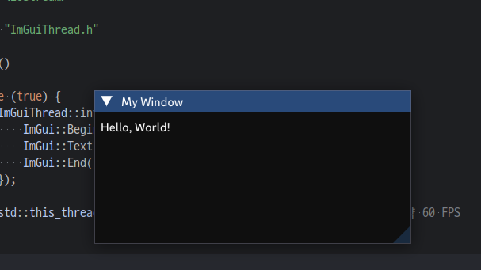
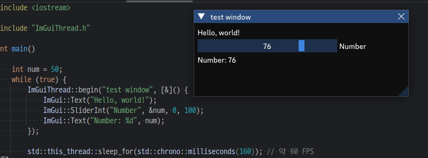

# ImGuiThread
`ImGuiThread` 클래스는 ImGui 창과 명령을 스레드 안전하게 관리할 수 있는 방법을 제공합니다.\
이를 통해 애플리케이션의 어느 스레드에서든 ImGui 창을 생성하고 관리할 수 있습니다.

## 필요 조건
- C++17 이상
- ImGui 라이브러리
- ImPlot 라이브러리 (플로팅 기능을 사용하는 경우)
- GLFW 및 GLEW 라이브러리

## 빌드 설정
- Vcpkg를 이용해 GLEW와 GLFW를 라이브러리를 설치해야 합니다.
- [ImGuiThread](ImGuiThread) 폴더 안에 [CMakeLists.txt](ImGuiThread/CMakeLists.txt) 파일을 이용해 쉽게 프로젝트에 통합할 수 있습니다.

### 의존성 설치
```bash
sudo apt update
sudo apt install -y git curl zip unzip tar cmake build-essential pkg-config
```

### vcpkg 설치
- 프로젝트 폴더 내에 vcpkg 폴더를 생성하고 vcpkg를 설치합니다.
```bash
git clone https://github.com/Microsoft/vcpkg.git vcpkg
cd vcpkg
./bootstrap-vcpkg.sh
```

### GLFW 설치
```bash
cd vcpkg
./vcpkg install glfw3
```

### GLEW 설치
```bash
cd vcpkg
./vcpkg install glew
```

### 빌드
```bash
mkdir build
cd build
cmake ..
cmake --build .
```

### 실행
```bash
cd build
./main
```

## CMakeLists.txt
- 프로젝트 이름은 `main`으로 설정합니다.
```cmake
cmake_minimum_required(VERSION 3.22)
project(main)

set(CMAKE_CXX_STANDARD 23)

# vcpkg 설정
set(CMAKE_TOOLCHAIN_FILE ${CMAKE_SOURCE_DIR}/vcpkg/scripts/buildsystems/vcpkg.cmake)
set(CMAKE_PREFIX_PATH ${CMAKE_SOURCE_DIR}/vcpkg/installed/x64-linux/share)

# 서브 디렉토리 ImGuiThread 추가
add_subdirectory(ImGuiThread)

# main.cpp 파일을 사용하여 실행 파일을 빌드
add_executable(${PROJECT_NAME} main.cpp)

# 실행 파일과 정적 라이브러리를 링크
target_link_libraries(${PROJECT_NAME} PRIVATE ImGuiThread)
```

## 기본 사용법

### 1. 헤더 포함하기

먼저 C++ 소스 파일에 헤더 파일을 포함시킵니다:

```c++
#include "ImGuiThread.h"
```

### 2. 기본적인 창 만들기
- invoke 메서드를 사용하여 ImGui 창을 만들 수 있습니다.


### 예제 코드:
```c++
int main()
{
    while (true) {
        ImGuiThread::invoke("UniqueID", []() {
            ImGui::Begin("My Window");
            ImGui::Text("Hello, World!");
            ImGui::End();
        });

        std::this_thread::sleep_for(std::chrono::milliseconds(160)); // 약 60 FPS
    }
}
```

### 3. 외부 변수 사용하기
- ImGui 렌더링은 독립적인 스레드에서 수행되므로 외부 변수를 사용하려면 람다 함수의 캡처를 사용해야 합니다.
- 아래 예제에서는 `num` 변수를 슬라이더로 사용합니다.
- 변수 조작 및 시각화를 위해 ImGui 라이브러리의 기능을 사용합니다.



### 예제 코드:
```c++
int main()
{
    int num = 50;
    while (true) {
        ImGuiThread::begin("test window", [&]() {
            ImGui::Text("Hello, world!");
            ImGui::SliderInt("Number", &num, 0, 100);
            ImGui::Text("Number: %d", num);
        });

        std::this_thread::sleep_for(std::chrono::milliseconds(160)); // 약 60 FPS
    }
}
```

### 4. 메인 루프

- invoke를 여러번 호출해도 됩니다.

### 예제 코드:
```c++
while (true) {
    ImGuiThread::begin("Window 1", []() {
        ImGui::Text("Content for Window 1");
    });

    ImGuiThread::begin("Window 2", []() {
        ImGui::Text("Content for Window 2");
    });

    ImGuiThread::invoke("Command 1", []() {
        // 일부 ImGui 명령
    });

    // CPU 사용량을 줄이기 위해 작은 지연 추가
    std::this_thread::sleep_for(std::chrono::milliseconds(16));
}
```

## 고급 사용법

### ImPlot 사용하기
### 예제 코드:
```c++
ImGuiThread::begin("Plot Window", []() {
    if (ImPlot::BeginPlot("My Plot")) {
        // 여기에 플로팅 코드를 작성하세요
        ImPlot::EndPlot();
    }
});


더 자세한 정보는 ImGui 문서와 `ImGuiThread` 클래스의 소스 코드를 참조하세요.
