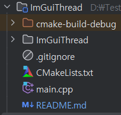

# ImGuiThread
C++ 프로젝트에서 간편하게 사용하기 위한 ImGui 라이브러리의 스레드 래퍼 클래스

## 필요 조건
- C++17 이상
- ImGui 라이브러리
- ImPlot 라이브러리 (플로팅 기능을 사용하는 경우)
- GLFW 및 GLEW 라이브러리

## 지원 플랫폼
- Windows: Visual Studio
- Linux: GCC, Clang

## 설치 방법
- ImGuiThread 폴더를 프로젝트 디렉토리에 복사합니다.
- 프로젝트 CmakeLists.txt 파일에 다음 코드를 추가합니다.
    ```cmake
    cmake_minimum_required(VERSION 3.22)
    project(main)
    
    set(CMAKE_CXX_STANDARD 17)
    
    add_subdirectory(ImGuiThread) # 서브 디렉토리 추가
    
    add_executable(${PROJECT_NAME} main.cpp)
    
    target_link_libraries(${PROJECT_NAME} PRIVATE ImGuiThread) # ImGuiThread 라이브러리 링크
    ```
- 프로젝트 구조 예시

  


## 빌드
```bash
mkdir build
cd build
cmake ..
cmake --build .
```

## 실행
```bash
cd build
./main
```

## 기본 사용법
- 이미지 창을 클릭하면 Visible 변수가 토글됩니다.

### 1. 헤더 포함하기

먼저 C++ 소스 파일에 헤더 파일을 포함시킵니다:

```c++
#include "ImGuiThread.h"
```

### 2. 기본적인 창 만들기
- invoke 메서드를 사용하여 ImGui 창을 만들 수 있습니다.


### 예제 코드:
```c++
int main()
{
    while (true) {
        ImGuiThread::invoke("UniqueID", []() {
            ImGui::Begin("My Window");
            ImGui::Text("Hello, World!");
            ImGui::End();
        });

        std::this_thread::sleep_for(std::chrono::milliseconds(160)); // 약 60 FPS
    }
}
```

### 3. 외부 변수 사용하기
- ImGui 렌더링은 독립적인 스레드에서 수행되므로 외부 변수를 사용하려면 람다 함수의 캡처를 사용해야 합니다.
- 아래 예제에서는 `num` 변수를 슬라이더로 사용합니다.
- 변수 조작 및 시각화를 위해 ImGui 라이브러리의 기능을 사용합니다.


### 예제 코드:
```c++
int main()
{
    int num = 50;
    while (true) {
        ImGuiThread::begin("test window", [&]() {
            ImGui::Text("Hello, world!");
            ImGui::SliderInt("Number", &num, 0, 100);
            ImGui::Text("Number: %d", num);
        });

        std::this_thread::sleep_for(std::chrono::milliseconds(160)); // 약 60 FPS
    }
}
```

### 4. 메인 루프

- invoke를 여러번 호출해도 됩니다.

### 예제 코드:
```c++
while (true) {
    ImGuiThread::begin("Window 1", []() {
        ImGui::Text("Content for Window 1");
    });

    ImGuiThread::begin("Window 2", []() {
        ImGui::Text("Content for Window 2");
    });

    ImGuiThread::invoke("Command 1", []() {
        // 일부 ImGui 명령
    });

    // CPU 사용량을 줄이기 위해 작은 지연 추가
    std::this_thread::sleep_for(std::chrono::milliseconds(16));
}
```

## 고급 사용법

### ImPlot 사용하기
### 예제 코드:
```c++
ImGuiThread::begin("Plot Window", []() {
    if (ImPlot::BeginPlot("My Plot")) {
        // 여기에 플로팅 코드를 작성하세요
        ImPlot::EndPlot();
    }
});
```

```c++

#include <iostream>
#include "ImGuiThread.h"

// 전역 변수
std::atomic<int> global_counter{ 0 };
std::atomic<bool> keep_running{ true };

// 다른 스레드에서 실행될 함수
void worker_thread() {
    while (keep_running) {
        // 전역 변수 증가
        global_counter++;
        std::this_thread::sleep_for(std::chrono::milliseconds(500));
    }
}

int main() {
    // 작업 스레드 시작
    std::thread worker(worker_thread);

    while (true) {
        // Window 1에서 전역 변수 출력
        ImGuiThread::begin("Window 1", []() {
            ImGui::Text("Counter: %d", global_counter.load());
        });

        // Window 2에서 전역 변수 수정
        ImGuiThread::begin("Window 2", []() {
            static int local_counter = 0;
            local_counter++;
            if (ImGui::Button("Increment Global Counter")) {
                global_counter++;
            }
            ImGui::Text("Local Counter: %d", local_counter);
        });

        // 특정 명령 실행
        ImGuiThread::invoke("Command 1", []() {
            if (ImGui::Button("Stop Worker Thread")) {
                keep_running = false;
            }
        });

        // CPU 사용량을 줄이기 위해 작은 지연 추가
        std::this_thread::sleep_for(std::chrono::milliseconds(16));

        // 작업 스레드를 멈추도록 명령이 실행된 경우 루프 종료
        if (!keep_running) break;
    }

    // 작업 스레드가 종료되기를 기다림
    worker.join();

    return 0;
}
```

더 자세한 정보는 ImGui 문서와 `ImGuiThread` 클래스의 소스 코드를 참조하세요.
